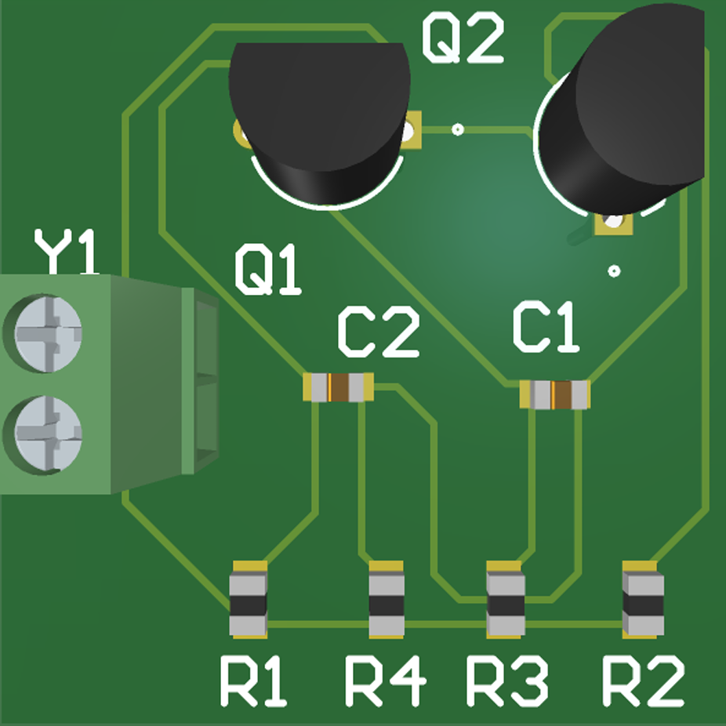

# Leveraging Large Language Models for Intelligent Power Electronics PCB Routing Optimization
This repository provides the official implementation of the paper:

"Leveraging Large Language Models for Intelligent Power Electronics PCB Routing Optimization"
KU Leuven - EnergyVille, 2025 ECCE Europe Submission (Accepted)

## Installation and Usage

1. Install dependencies with:
<pre> ```pip install -r requirements.txt ``` </pre>

2. Usage
Prepare Input File: You need to prepare a layout.json file as the algorithm input. This file should contain the component types and their location information on the PCB.

Note: Due to proprietary constraints, the example layout.json is not open-sourced.

Run the Router:
Navigate to the project directory and run:

<pre> ```cd LLM_PCB_Router python main.py ``` </pre>

This will load your layout.json, interact with a large language model to analyze the layout, use an improved A* algorithm to generate optimized routing paths, output the routing results with visualization

## Example Results



